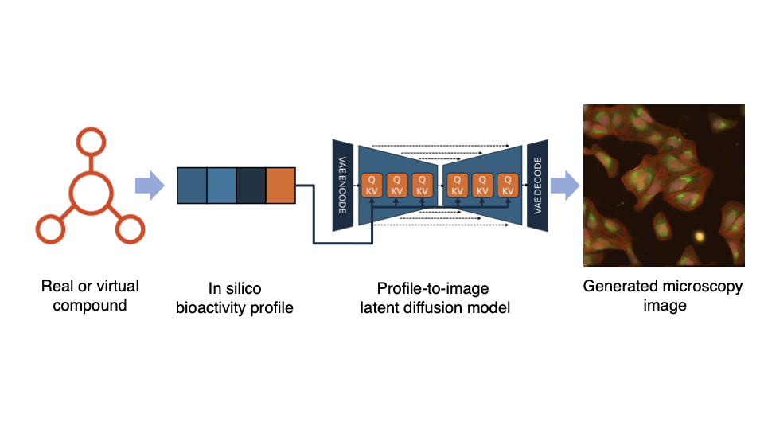

# pDIFF - Profile-guided Latent Diffusion for Generative High-Content Imaging

## Contact 
Steven Cook 
steven-1.cook@novartis.com

William Godinez 
william_jose.godinez_navarro@novartis.com

## Introduction

pDIFF is a framework for training Latent Diffusion models to predict
high-content images from bioactivity profiles.  It contains classes to
wrap paired profile-image data as a dataset, train a model, and run
inference to create a new set of generated images.

Documentation available in /docs/build/html directory

## Paper

Cook et al. "A diffusion model conditioned on compound
bioactivity profiles for predicting high-content
images" [URL TBD]

## License

Copyright (c) 2026 Novartis Biomedical Research Inc. Licensed under the MIT License. See LICENSE file in the project root.

## Contents

- `src`: Python source code for pDIFF
- `data`: sample images and latent diffusion model components
- `tests`: tests and sample images and latent diffusion model components
- `docs`: HTML documentation for pDIFF and sphinx configuration
- `models`: when training, this folder will be created and populated with log files, checkpoints, and saved full pDIFF model pipeline components

## System requirements

### Hardware
#### GPUs

We have tested pDIFF on machines with the following GPUs:

- NVIDIA A100 40GB

### Software

#### Operating systems

We have tested pDIFF on machines with the following systems:

- Red Hat Enterprise Linux release 8.8 (Ootpa)

#### Software Dependencies

- See full list in `pyproject.toml`

## Installation

1. Clone this repository

2. Create a new virtual environment. pDIFF has been tested with python3.8 but newer versions should work.
example: `conda create -n pdiff python=3.8`

3. Install via pip using pyproject.toml: from root directory, run: `pip install -e .`

4. Confirm tests are passing: from root directory, run: `pytest tests/`
Some warnings are expected.

## Run Sample Training

In this example we replace bioactivity profiles with chemical
fingerprints to demonstrate training.  The example data includes
fingerprints and images for 16 compounds.

0. **Optional** - create a copy of /scripts/accelerate_1gpu_fp32.yaml and adjust multi-GPU configuration as necessary.
Update scripts/sample_train_script.sh to call this new configuration file.
<https://huggingface.co/docs/accelerate/en/index>

1. Update sample_train_script.sh: in the "conda activate" line, replace with the name of your environment, or remove altogether if you're planning
to run the script directly. 

2. Run training script directly or through a QSUB job submission system on HPC:
 **Direct execution option**: In a CUDA-capable environment with a GPU available, in the scripts directory, run `./sample_train_script.sh` 

**QSUB execution option**: adjust the QSUB argument comments at the top of sample_train_script.sh and submit to your scheduler. 

3. Observe training progress. Currently Tensorboard is supported:
`tensorboard --log_dir /models/logs` (--bind_all and --port=XXXX if needed)

## Custom Data Training

1. Create a dataframe like the one stored in `/data/morgan_mininvps.pkl` to contain paths to your data and insert
the corresponding profiles. Let's call it `/data/your_data.pkl`. Ensure you can load the new pkl file in a pDiffMetadata instance and access it correctly before proceeding.

2. Create a copy of the sample training script in `scripts/sample_train_script.sh` to point to your new pickled dataframe. Adjust other hyperparameters as necessary.

3. invoke training script 

## Inference

1. Once model is trained, run through `/scripts/sample_inference.ipynb` to generate new images.

